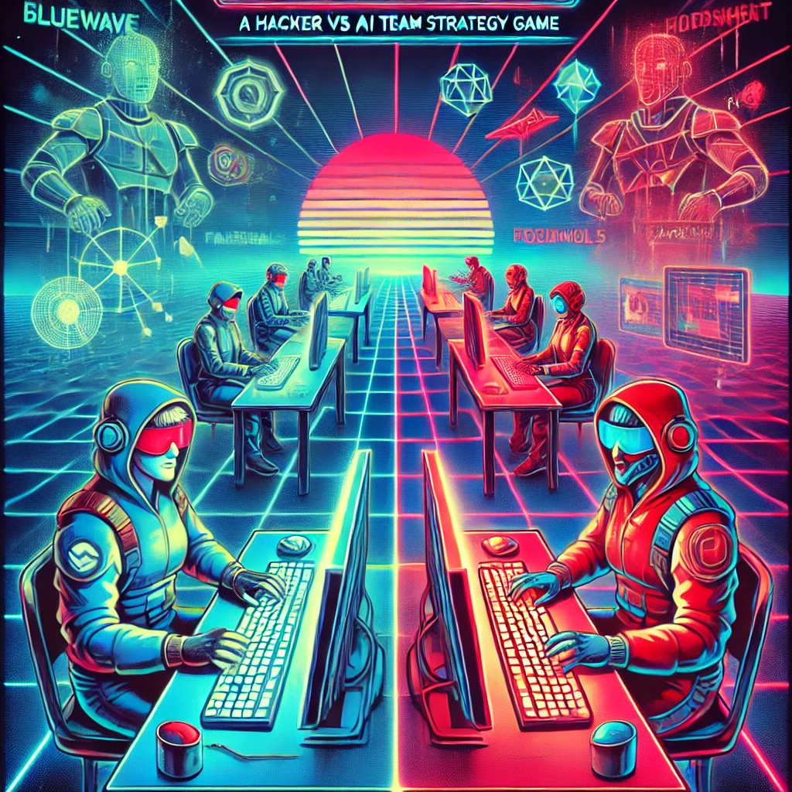

# 🔐 Lockout Game

**Lockout** game — a Webex-integrated, real-time multiplayer word game inspired by _Codenames_, reimagined with a **hacker vs cybersecurity AI theme**.

Players join teams, take on roles, ready up, and launch into a game session directly within a Webex meeting using **Socket.IO + LobbyContext-powered React frontend**.

---

## 🚀 Gameplay Theme – Lockout

In the digital underworld, two rival hacker groups — **Bluewave** and **Redshift** — compete to extract sensitive data from a hostile AI system known as **Sentinel**.

- 🧠 **Hackers** (Team Leads): Give strategic clues
- 🤖 **AI Agents** (Teammates): Decode clues and extract files
- 💀 **Cybersecurity Traps**: One wrong guess, game over
- 🕸 **Honeypots**: Decoys planted by Sentinel

Only one team will breach the vault. Will you outsmart the AI, or fall into its trap?

---

## 🚀 Getting Started

### Prerequisites

Before you begin, ensure you have the following installed:

- **Node.js** (v20 LTS recommended - see `.nvmrc`) and **npm**
- **Python** (v3.12 or higher)
- **Git**

> **Note:** If you use [nvm](https://github.com/nvm-sh/nvm), simply run `nvm use` in the project root to switch to the correct Node version.

### Installation

1. **Clone the repository**

```bash
git clone <repository-url>
cd lockout-game
```

2. **Set up the Backend**

```bash
cd backend

# Create a virtual environment
python3 -m venv venv

# Activate the virtual environment
# On macOS/Linux:
source venv/bin/activate
# On Windows:
# venv\Scripts\activate

# Install Python dependencies
pip install -r requirements.txt
```

3. **Set up the Frontend**

```bash
cd ../frontend

# Install Node dependencies
npm install
```

### Configuration

Create a `.env` file in the `backend` directory with the following variables:

```bash
FLASK_ENV=development
SECRET_KEY=your-secret-key-here
# Add any other required environment variables
```

### Running the Application

You'll need to run both the backend and frontend servers:

1. **Start the Backend Server**

```bash
# From the project root directory
source backend/venv/bin/activate  # Activate virtual environment
python -m backend.app
```

The backend server will start on `http://localhost:5000`

> **Note:** The backend must be run as a module from the project root using `python -m backend.app` due to relative imports.

2. **Start the Frontend Development Server**

In a new terminal:

```bash
cd frontend
npm run dev
```

The frontend will start on `http://localhost:5173`

3. **Access the Application**

Open your browser and navigate to `http://localhost:5173`

### Running Tests

**Frontend Tests:**

```bash
cd frontend
npm test                    # Run tests in watch mode
npm run test:coverage       # Run tests with coverage report
```

**Backend Tests:**

```bash
cd backend
source venv/bin/activate
pytest
```

---

## 🧩 Architecture Overview

This frontend is a **Vite + React application** using:

- **React Context API** (no Redux, no external state libraries)
- **MUI v6** for component design
- **Socket.IO** for real-time updates
- **Webex Embedded Apps SDK** for user and meeting identity

---

## 🔧 Key Features

| Feature                          | Description                                                                                                   |
| -------------------------------- | ------------------------------------------------------------------------------------------------------------- |
| 🔐 **LobbyContext**              | All lobby state (participants, roles, team, ready status) is managed globally via React Context               |
| 🔄 **WebSocket Updates**         | All state changes are real-time via `Socket.IO`                                                               |
| 💬 **Team Role Assignment**      | One Hacker per team; players can switch teams or roles                                                        |
| ✅ **Ready Up System**           | Players mark themselves "Ready"; game won't start until conditions are met                                    |
| 🗡 **Self-contained Components** | UI components like `LobbyDetails`, `LobbyParticipants`, and `LobbyActions` are all context-aware and reusable |
| ⚡ **Hot Module Reload Safe**    | All context is split properly for HMR support                                                                 |

---

## 📚 How to Use `LobbyContext` in Components

```js
import { useLobbyContext } from '../context/useLobbyContext';

const MyComponent = () => {
  const {
    lobby,
    user,
    joinLobby,
    toggleReady,
    isUserTeamLead,
    updateDisplayName,
  } = useLobbyContext();

  return <div>Welcome, {user?.display_name}</div>;
};
```

> Must be rendered within a `<LobbyProvider lobbyId="..." initialUser={...}>` scope.

---

## 🧪 Developer Tip – Testing a Component in Isolation

```jsx
import { LobbyContext } from '../context/LobbyContext';

<LobbyContext.Provider value={mockContextValue}>
  <MyComponent />
</LobbyContext.Provider>;
```

---

## 🎞 Game Start Conditions (Enforced by Backend)

- ✅ **Each team has one Hacker (team lead)**
- ✅ **Teams are balanced**
- ✅ **All players are Ready**

Optionally, the **Game Host** can use **Force Start** (bypasses balance check but not readiness).

---

## 🚀 Deployment

The Lockout Game is designed for deployment on AWS using a split architecture:

- **Backend (Flask + Socket.IO)**: AWS ECS Fargate with Application Load Balancer
- **Frontend (React)**: AWS Amplify with CloudFront CDN

### Deployment Architecture

```
┌─────────────┐
│   Users     │
└──────┬──────┘
       │ HTTPS
       │
┌──────▼────────┐
│  AWS Amplify  │
│   Frontend    │
│  CloudFront   │
└──────┬────────┘
       │ API/WebSocket
       │ HTTPS
       │
┌──────▼─────────┐
│   ALB (HTTPS)  │
│   Backend API  │
└──────┬─────────┘
       │
┌──────▼────────┐
│  ECS Fargate  │
│  Flask Tasks  │
└───────────────┘
```

### Quick Start Deployment

1. **Deploy Backend to ECS Fargate**

   - See [AWS Backend Deployment Guide](docs/aws-backend-deployment.md)
   - Estimated setup time: 30-60 minutes

2. **Deploy Frontend to Amplify**

   - See [AWS Frontend Deployment Guide](docs/aws-frontend-deployment.md)
   - Estimated setup time: 15-30 minutes

3. **Troubleshooting**
   - See [Deployment Troubleshooting Guide](docs/deployment-troubleshooting.md)

### Local Testing with Docker

Test the backend in a production-like environment:

```bash
# Build and run backend container
docker-compose up --build

# Backend available at http://localhost:5000
# Test health: curl http://localhost:5000/health
```

### CI/CD

Automated deployments are configured via GitHub Actions:

- **Backend**: Deploys to ECS on changes to `backend/` directory
- **Frontend**: Deploys to Amplify on changes to `frontend/` directory

See `.github/workflows/` for workflow configurations.

### Environment Variables

**Backend** (AWS Secrets Manager):

- `FLASK_ENV` - Application environment (production)
- `SECRET_KEY` - Flask secret key (generate securely)
- `FRONTEND_URL` - Frontend domain for CORS
- `ALLOWED_ORIGINS` - Comma-separated list of allowed origins

**Frontend** (AWS Amplify Environment Variables):

- `VITE_API_URL` - Backend API URL
- `VITE_SOCKET_URL` - Backend WebSocket URL

See `env.template` and `backend/env.production.template` for examples.

---

## 📜 Contribution Notes

- Use `Grid2` from `@mui/material` with the `size={{ xs, sm }}` prop.
- Follow Prettier config:
  ```json
  {
    "singleQuote": true,
    "tabWidth": 2,
    "useTabs": false,
    "semi": true,
    "endOfLine": "auto"
  }
  ```
- All Python backend code is formatted via Ruff.
- Context-based code is preferred over prop-drilling or hooks with duplicate state.

---

Made with ❤️ by the Webex Developer Relations Team
